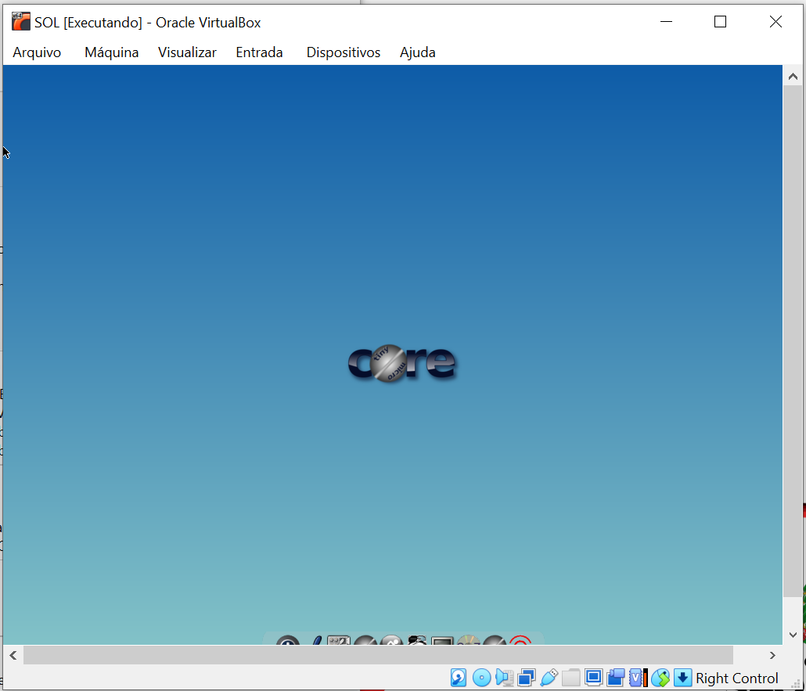
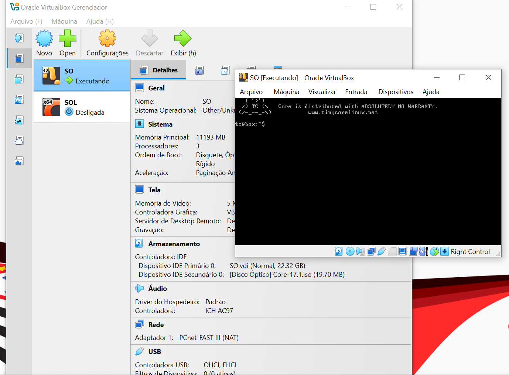

# Guia Prático: Máquinas Virtuais e Instalação de Sistemas Operacionais no Oracle VM VirtualBox

---

## 📌 1. O que é uma Máquina Virtual (VM)?

Uma **Máquina Virtual (VM - Virtual Machine)** é uma representação em software de um computador físico. Ela executa um sistema operacional (denominado *Sistema Convidado* ou *Guest*) e aplicações de forma isolada em relação ao sistema operacional hospedeiro (*Host*).

### Conceitos Chave:
- **Hypervisor (ou Monitor de Máquina Virtual - VMM):** Camada de software responsável por gerenciar a execução das máquinas virtuais, realizando a abstração e a distribuição dos recursos de hardware (CPU, Memória RAM, Armazenamento, Placa de Rede) entre a máquina real e as máquinas virtuais.
- **Sistema Hospedeiro (Host):** O sistema operacional original instalado diretamente no hardware da máquina física (ex: Windows 11, Linux, macOS).
- **Sistema Convidado (Guest):** O sistema operacional instalado e executado dentro do ambiente virtualizado.
- **Arquivo ISO:** Uma imagem de disco (cópia idêntica bit a bit de um disco óptico como CD/DVD) utilizada como mídia virtual para carregar e instalar um sistema operacional na VM.

---

## 📑 2. Estrutura e Componentes do Sistema Operacional na Virtualização

Durante o funcionamento e a instalação de um SO em uma Máquina Virtual, diversos componentes fundamentais da arquitetura de sistemas operacionais atuam diretamente:

### ⚙️ Componentes Envolvidos
1. **Kernel (Núcleo):** É o componente central do SO. Na virtualização, existe o kernel do sistema hospedeiro (gerenciando o hypervisor) e o kernel do sistema convidado (gerenciando as instruções da VM). O kernel faz a ponte entre os programas e a CPU/memória.
2. **Gerenciador de Memória:** Aloca blocos de RAM real para uso exclusivo ou compartilhado pela máquina virtual.
3. **Gerenciador de Processos e Escalonador:** Trata a execução da máquina virtual como processos no sistema hospedeiro e escalona as *threads* de CPU virtualizada.
4. **Sistema de Arquivos:** Responsável por formatar os discos rígidos virtuais (arquivos como `.vdi` ou `.vmdk`), organizando diretórios, permissões e blocos de dados.
5. **Drivers e E/S (Entrada/Saída):** Emulam dispositivos como adaptadores de rede, placas de vídeo e controladores de disco (IDE/SATA/NVMe).

---

## 🛠️ 3. Passo a Passo: Instalação de uma Imagem ISO no Oracle VM VirtualBox

Abaixo descrevemos o processo completo para a criação e instalação de um sistema operacional a partir de uma imagem ISO (como o **Tiny Core Linux** ou **Windows**).

### Passo 1: Criação da Máquina Virtual
1. Abra o **Oracle VM VirtualBox Gerenciador**.
2. Clique no botão **Novo** (`Ctrl + N`).
3. Defina o **Nome** da máquina virtual (ex: `SO` ou `SOL`), escolha a pasta onde os arquivos serão salvos e selecione o **Tipo** e **Versão** do sistema operacional.
4. Configure a quantidade de **Memória RAM** e número de **Processadores** (CPUs).

### Passo 2: Criação do Disco Rígido Virtual
1. Escolha a opção de **Criar um novo Disco Rígido Virtual**.
2. Selecione o formato do disco (ex: `VDI - VirtualBox Disk Image`).
3. Defina o tipo de armazenamento (Dinamicamente Alocado ou Tamanho Fixo) e determine a capacidade máxima do disco (ex: `22,32 GB`).

### Passo 3: Vinculação da Imagem ISO (Drive Óptico Virtual)
1. Selecione a VM criada na lista lateral e clique em **Configurações** (`Ctrl + S`).
2. Vá até a aba **Armazenamento**.
3. Na *Controladora IDE* (ou SATA), selecione o dispositivo do **Disco Óptico (Vazio)**.
4. Clique no ícone de disco no canto direito e escolha a opção **"Escolher um arquivo de disco..."**, selecionando a sua imagem ISO baixada (ex: `Core-17.1.iso`).

---

## 🖼️ 4. Demonstração e Execução de Máquinas Virtuais no VirtualBox

Abaixo são apresentadas as imagens de demonstração de máquinas virtuais configuradas e em execução no Oracle VM VirtualBox.

### 4.1 Interface Gráfica do Sistema Operacional Convidado
Na imagem a seguir, podemos observar o ambiente gráfico da máquina virtual `SOL` rodando o sistema operacional **Tiny Core Linux** em modo de exibição de área de trabalho:

### 4.2 Gerenciador do VirtualBox e Execução em Modo Terminal (CLI)
Abaixo, vemos a janela principal do **Oracle VM VirtualBox Gerenciador** com as configurações da máquina `SO` (detalhando Memória, Processadores, Armazenamento com o ISO `Core-17.1.iso` montado) e a janela da VM rodando em modo de linha de comando (CLI):

---

## ⏱️ 5. Linha do Tempo e Mapeamento de Conceitos de SO

A tabela a seguir correlaciona as etapas da instalação e execução da Máquina Virtual com os conceitos estudados de Arquitetura de Sistemas Operacionais:

| Etapa | O que acontece? | Conceito Envolvido | Por que é importante? |
|---|---|---|---|
| **1. Criação e Alocação** | Definição de RAM, CPU e tamanho de disco virtual no VirtualBox. | **Gerenciamento de Recursos e Abstração** | Garante que a VM tenha hardware virtual delimitado sem esgotar o sistema host. |
| **2. Montagem do ISO** | Anexação da imagem ISO ao leitor de disco óptico virtual da VM. | **Subsistema de Entrada/Saída (E/S)** | Emula uma mídia de boot física para que o sistema possa ler os arquivos de instalação. |
| **3. Boot e Kernel Load** | O sistema lê o disco óptico e carrega o Kernel do SO convidado na RAM virtual. | **Kernel e Modos de Execução** | O Kernel assume o controle do hardware virtual e inicia a alternância para Modo Kernel. |
| **4. Carregamento de Drivers** | O SO convidado detecta controladores virtuais (ex: PCnet-FAST III, ICH AC97). | **Drivers de Dispositivos** | Permite a comunicação do SO convidado com os componentes emulados pelo VirtualBox. |
| **5. Execução de Processos** | Inicialização dos serviços, shell (`tc@box:~$`) ou servidor X (interface gráfica). | **Processos e Threads** | Permite a execução das aplicações de usuário em **Modo Usuário** de forma isolada. |

---

## 🧩 6. Desafio e Reflexão Final

> **Se não existisse a camada de virtualização (Hypervisor) nem o Sistema Operacional, como seria o uso dos recursos do computador?**

**Resposta:**
Sem o Sistema Operacional e sem o Hypervisor, os programas teriam que ser gravados diretamente na memória física e codificados em linguagem de máquina específica para controlar cada componente de hardware. Não haveria concorrência de processos, multitarefa nem isolamento de segurança. Qualquer erro em um programa resultaria no travamento completo do equipamento, e a execução de múltiplos sistemas simultâneos em uma mesma máquina seria fisicamente impossível.

---

## 📦 7. Conclusão

A utilização de Máquinas Virtuais no Oracle VM VirtualBox ilustra na prática como os conceitos teóricos de **Kernel, Gerenciamento de Memória, Processos, Sistema de Arquivos e Drivers de E/S** trabalham juntos para fornecer um ambiente computacional seguro, flexível e totalmente isolado.
