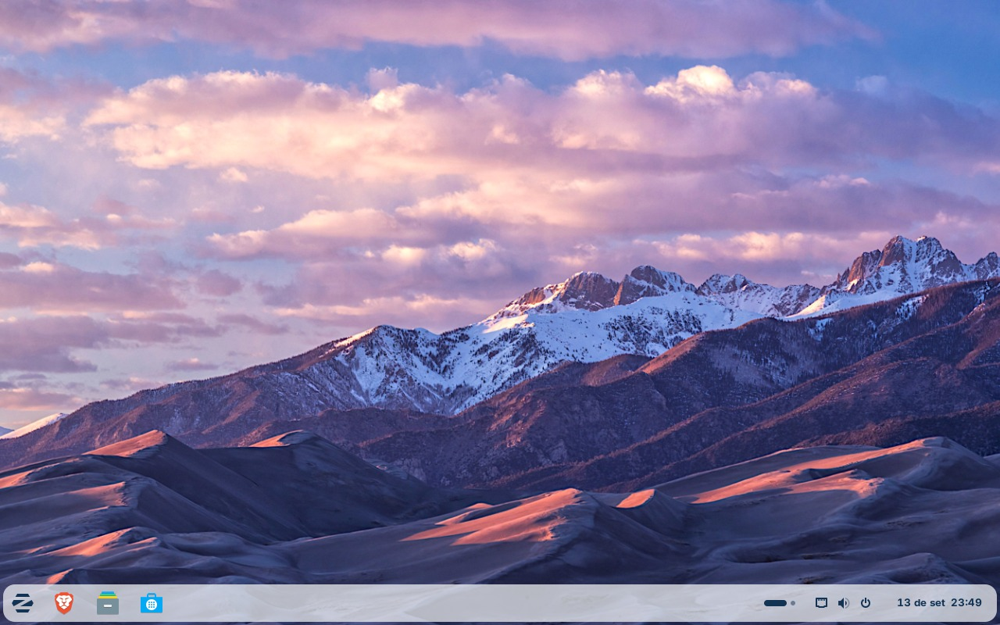
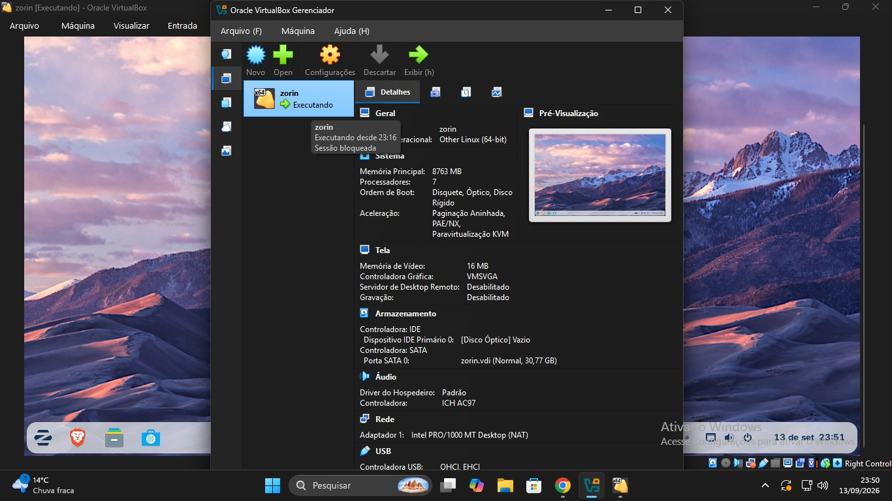

# Zorin OS 18 — Sistema Operacional Linux

## 1. Introdução

O **Zorin OS** é uma distribuição Linux criada para reduzir a dificuldade de migração para o Linux. Ele é baseado no Ubuntu e busca oferecer uma experiência de desktop familiar, moderna, simples e personalizável.

De acordo com o material fornecido, a série Zorin OS 18 utiliza como base o **Ubuntu 24.04 LTS**, possui interface baseada no GNOME Shell nas edições Core e Pro e é voltada para usuários domésticos, escolas, empresas e pessoas que desejam conhecer o Linux.



*Figura 1 — Área de trabalho do Zorin OS.*

---

## 2. O que é o Zorin OS?

O Zorin OS é um sistema operacional baseado em Linux e Ubuntu. Seu principal objetivo é facilitar a entrada de novos usuários no mundo Linux sem abrir mão das possibilidades de personalização e do uso de software livre.

Entre suas principais características estão:

- Interface familiar para quem utiliza Windows;
- Personalização do ambiente gráfico;
- Base Ubuntu LTS;
- Suporte a diferentes formatos de aplicativos;
- Ferramentas para produtividade, estudos e desenvolvimento;
- Possibilidade de executar determinados aplicativos do Windows por meio do suporte opcional a aplicativos Windows;
- Boa opção para testes em máquinas virtuais.

A ferramenta **Zorin Appearance** permite modificar a organização do desktop, incluindo layouts inspirados em ambientes conhecidos. Na edição Core existem quatro layouts básicos, enquanto a edição Pro oferece mais opções de personalização.

---

## 3. Como o Zorin OS foi criado

O projeto Zorin OS começou em **2008**, com a ideia de tornar o Linux mais acessível para usuários que não estavam acostumados com esse sistema.

O projeto foi iniciado pelos irmãos **Artyom Zorin e Kyrill Zorin**, e a empresa responsável pelo projeto está sediada em Dublin, na Irlanda.

### Linha do tempo

| Ano | Acontecimento |
|---|---|
| **2008** | Início do projeto com foco em tornar o Linux mais acessível. |
| **2009** | Lançamento do Zorin OS 1.0, primeira versão pública. |
| **2016** | Zorin OS 12 introduz o Zorin Appearance, a loja de software e um novo desktop. |
| **2019** | Zorin OS 15 traz o Zorin Connect, novo tema, melhorias de desempenho e suporte a Flatpak. |
| **2021** | Zorin OS 16 apresenta novo visual, gestos de toque e suporte ampliado a aplicativos. |
| **2023** | Zorin OS 17 apresenta multitarefa renovada, Spatial Desktop e aplicativos atualizados. |
| **2025** | Zorin OS 18 chega com novo design, base Ubuntu 24.04, melhorias de desempenho, RDP remoto e PipeWire. |
| **2026** | A versão atual indicada nas fontes oficiais é o Zorin OS 18.1. |

---

## 4. Zorin OS 18.1

O material fornecido apresenta o Zorin OS 18 como uma versão moderna da distribuição. Atualmente, a versão mais recente da série é o **Zorin OS 18.1**.

### Características técnicas

- **Base:** Ubuntu 24.04 LTS;
- **Desktop:** GNOME Shell nas edições Core e Pro;
- **Arquitetura:** x86-64 para processadores Intel e AMD;
- **Formatos de aplicativos:** APT, Flatpak, Snap, `.deb`, AppImage e, com suporte opcional, `.exe` e `.msi`;
- **Suporte de atualizações e correções de segurança:** até **1º de junho de 2029**;
- **Kernel:** Linux 6.17 na versão 18.1.

### Principais novidades

Entre os recursos destacados estão:

- Novo visual com tema mais arredondado;
- Painel flutuante;
- Busca global por nome ou conteúdo no aplicativo Arquivos;
- Login remoto por RDP;
- PipeWire para áudio com menor latência;
- Drivers atualizados;
- Melhor suporte a hardware;
- Otimizações de desempenho.

---

## 5. Edições do Zorin OS

A família Zorin OS possui diferentes edições para públicos diferentes.

### Zorin OS Core

É a edição gratuita destinada ao uso geral. Ela inclui aplicativos essenciais e quatro layouts básicos do desktop.

É uma boa opção para quem está começando a utilizar o Zorin OS.

### Zorin OS Pro

É a edição paga. Ela possui mais opções de personalização, aplicativos adicionais de produtividade e criatividade e inclui suporte de instalação.

A edição Pro também ajuda a financiar o desenvolvimento do projeto.

### Zorin OS Education

É uma edição gratuita voltada para escolas, alunos e professores. Ela inclui aplicativos educacionais e ferramentas voltadas para o ambiente escolar.

### Zorin OS Lite

A série 18.1 também possui uma edição Lite, baseada no **XFCE**, destinada principalmente a computadores mais modestos.

---

## 6. Suporte do Zorin OS

É importante diferenciar dois tipos de suporte:

### Suporte do sistema

O Zorin OS 18.1 recebe atualizações de software e correções de segurança até **1º de junho de 2029**. Isso significa que o usuário pode utilizar a versão durante vários anos mantendo o sistema atualizado.

### Suporte de instalação

A edição **Pro** oferece serviço de suporte para ajudar na configuração e instalação do Zorin OS. As edições gratuitas não possuem esse mesmo serviço comercial de instalação.

Para problemas técnicos e documentação, o projeto também mantém uma central de ajuda oficial.

---

## 7. Requisitos de sistema

O material fornecido apresenta os seguintes requisitos mínimos oficiais:

- **Processador:** dual-core de 1 GHz, 64 bits;
- **Memória RAM:** 2 GB;
- **Armazenamento:** 15 GB para a edição Core;
- **Tela:** resolução mínima de 800 × 600.

Esses valores são indicados para uma instalação real. Para uma máquina virtual, o material recomenda uma configuração mais confortável:

- **2 a 4 vCPUs**;
- **4 GB de RAM ou mais**;
- **25 a 30 GB de disco virtual dinâmico**;
- Aceleração gráfica, quando disponível.

A configuração ideal depende do hardware do computador que está executando a máquina virtual.

---

# 8. Como baixar o Zorin OS

A forma recomendada é utilizar o site oficial do projeto.

**Página oficial de download:**  
https://zorin.com/os/download/

Atualmente, o site oficial disponibiliza o **Zorin OS 18.1 Core** gratuitamente, além das edições Education, Lite e Pro.

### Passo a passo

1. Acesse o site oficial do Zorin OS:
   `https://zorin.com/os/download/`
2. Escolha a edição desejada.
3. Para começar gratuitamente, selecione **Zorin OS 18.1 Core**.
4. Clique em **Download**.
5. Será baixado um arquivo no formato **ISO**.
6. Guarde o arquivo ISO em uma pasta de fácil acesso, pois ele será usado como disco de instalação da máquina virtual.

### Verificação do arquivo ISO

Para aumentar a segurança, o Zorin OS disponibiliza valores **SHA256** para verificar se o arquivo baixado está íntegro.

Para o **Zorin OS 18.1 Core 64-bit**, o SHA256 informado oficialmente é:

```text
44649b97bd307fc4c8529205d098ebbf98575a1e1ba2ee7d7005b697af1721d5
```

Se o valor calculado no computador for diferente do valor oficial, recomenda-se baixar novamente a ISO.

---

# 9. O que é uma máquina virtual?

Uma máquina virtual é um computador criado por software dentro de outro computador.

No caso deste projeto:

- **Host:** Windows, macOS ou Linux que está rodando no computador principal;
- **Virtualizador:** Oracle VirtualBox;
- **Guest:** Zorin OS 18;
- **Hardware virtual:** memória RAM, processador, armazenamento e outros dispositivos são apresentados à máquina virtual.

A virtualização permite testar o Zorin OS sem substituir o sistema operacional principal.

### Vantagens

- Testar o Linux sem apagar o Windows;
- Manter o sistema principal intacto;
- Criar snapshots;
- Isolar o ambiente de testes;
- Remover a máquina virtual quando ela não for mais necessária;
- Recriar a máquina virtual com facilidade.

---

# 10. Como criar uma máquina virtual do Zorin OS no VirtualBox

O procedimento abaixo é um passo a passo prático para reproduzir a experiência apresentada no material.

## 10.1 Instalar o VirtualBox

1. Baixe e instale o **Oracle VM VirtualBox** no sistema operacional principal.
2. Abra o VirtualBox.
3. Clique em **Novo** para criar uma máquina virtual.

## 10.2 Definir o nome e a ISO

Na tela de criação:

1. Em **Nome**, coloque algo como:
   `Zorin OS 18`
2. Selecione a pasta onde a máquina virtual será armazenada.
3. Em **ISO Image**, selecione o arquivo `.iso` baixado do Zorin OS.
4. Se aparecer uma opção para instalação automática e você quiser acompanhar manualmente o processo, marque a opção equivalente a **Skip Unattended Installation**.
5. Avance para a próxima etapa.

## 10.3 Configurar o hardware

Para uma VM confortável, seguindo a recomendação do material:

- **Processadores:** 2 a 4 CPUs virtuais;
- **Memória:** 4096 MB (4 GB) ou mais;
- **Disco virtual:** 25 a 30 GB;
- Preferencialmente utilize um disco de expansão dinâmica.

É importante não reservar toda a memória ou todos os processadores do computador para a VM, pois o sistema principal também precisa continuar funcionando.

## 10.4 Criar o disco virtual

Escolha a opção para criar um novo disco virtual.

Uma configuração prática é:

```text
Tipo: VDI
Armazenamento: dinamicamente alocado
Tamanho: 30 GB
```

O armazenamento dinâmico permite que o arquivo do disco virtual cresça conforme o Zorin OS utiliza espaço, em vez de ocupar todo o tamanho imediatamente.

## 10.5 Iniciar a máquina virtual

Depois de terminar a configuração:

1. Selecione a máquina virtual **Zorin OS 18**.
2. Clique em **Iniciar**.
3. O VirtualBox iniciará a partir da ISO.
4. O instalador do Zorin OS será carregado.
5. Siga as instruções apresentadas pelo instalador.
6. Ao concluir a instalação, reinicie a máquina virtual.
7. Se o VirtualBox solicitar a remoção da ISO, remova/desmonte a imagem ISO para que a VM inicialize pelo disco virtual.

---

## 11. Exemplo de configuração utilizada

A imagem abaixo mostra o Zorin OS funcionando dentro do VirtualBox e o Gerenciador do VirtualBox identificando a máquina como **zorin**.



*Figura 2 — Zorin OS executando em uma máquina virtual no Oracle VirtualBox.*

Na imagem, a máquina virtual aparece com uma configuração de aproximadamente:

- **8.763 MB de RAM**;
- **7 processadores**;
- Disco virtual `zorin.vdi` com aproximadamente **30,77 GB**;
- Controladora gráfica VMSVGA;
- Rede configurada em NAT.

Essa configuração mostrada na imagem é superior à sugestão mínima de 2–4 vCPUs e 4 GB de RAM apresentada no material, portanto representa uma configuração específica da máquina utilizada no exemplo, e não um requisito obrigatório.

---

# 12. O que fazer depois da instalação

Depois de instalar o Zorin OS na máquina virtual, é possível:

1. Explorar a interface;
2. Testar o menu e os layouts do Zorin Appearance;
3. Abrir o navegador;
4. Testar o LibreOffice;
5. Instalar programas pela Software Store;
6. Utilizar o Terminal;
7. Testar aplicativos Linux;
8. Criar um snapshot antes de realizar mudanças importantes;
9. Praticar comandos Linux sem modificar o sistema operacional principal.

A máquina virtual é especialmente útil para estudantes porque permite experimentar o sistema com baixo risco.

---

# 13. Vantagens e limitações

## Vantagens

- Core gratuita e baseada em software livre;
- Interface amigável;
- Base Ubuntu LTS;
- Boa variedade de formatos de aplicativos;
- Forte personalização;
- Atualizações de segurança até 2029;
- Excelente opção para testes em máquina virtual.

## Limitações

- Nem todo programa do Windows possui versão para Linux;
- A compatibilidade de aplicativos Windows pode variar;
- Alguns jogos e sistemas anti-cheat podem não funcionar;
- A edição Pro é paga;
- É necessário algum período de adaptação aos conceitos e ferramentas do Linux;
- Uma máquina virtual não reproduz necessariamente 100% do desempenho de uma instalação nativa.

---

# 14. Zorin OS x Windows 11

| Critério | Zorin OS 18 | Windows 11 |
|---|---|---|
| Licença | Core gratuita / código aberto | Proprietária |
| Interface | Altamente personalizável | Padronizada, com personalização |
| Aplicativos Windows | Compatibilidade parcial | Nativa |
| Desenvolvimento Linux | Nativo | WSL e ferramentas adicionais |
| Virtualização | Excelente para laboratório | Pode atuar como host ou guest |
| Hardware | Requisitos mínimos mais modestos | Requisitos oficiais mais rígidos |

A comparação não significa que um sistema seja melhor em todos os aspectos. Os dois possuem propostas diferentes.

---

# 15. Conclusão

O Zorin OS é uma distribuição Linux criada para tornar a utilização do Linux mais simples para novos usuários. Sua interface familiar, possibilidade de personalização, base Ubuntu e variedade de aplicativos fazem dele uma opção interessante para estudos, trabalho, desenvolvimento e educação.

A utilização em uma máquina virtual é especialmente útil para aprender, pois permite testar o sistema sem substituir o sistema operacional principal.

Dessa forma, o usuário pode baixar a ISO do Zorin OS, criar uma máquina virtual no VirtualBox, instalar o sistema e explorar suas ferramentas em um ambiente isolado.

> **Mensagem principal:** virtualizar permite aprender um novo sistema operacional com segurança e flexibilidade.

---

# 17. Outros sistemas operacionais apresentados

Além do Zorin OS, a apresentação também considerou outras distribuições Linux: **Kali Linux, Lubuntu, Fedora e Linux Mint**. Cada uma possui objetivos e características diferentes.

## 17.1 Tabela comparativa

| Sistema | Base / ambiente | Principal objetivo | Particularidades |
|---|---|---|---|
| **Zorin OS** | Base Ubuntu; GNOME nas edições Core/Pro | Desktop fácil de usar e migração para Linux | Interface familiar, forte personalização, boa opção para iniciantes e para virtualização |
| **Kali Linux** | Base Debian | Segurança da informação e testes de penetração | Grande conjunto de ferramentas de segurança, análise de redes, forense e testes de vulnerabilidade |
| **Lubuntu** | Base Ubuntu; LXQt | Desktop leve e eficiente | Consome poucos recursos e é uma alternativa interessante para computadores mais modestos |
| **Fedora** | Linux independente, desenvolvido pelo Fedora Project | Desktop, desenvolvimento, servidores, containers e tecnologias recentes | Foco em software livre e tecnologias atuais; Fedora Workstation utiliza GNOME por padrão |
| **Linux Mint** | Base Ubuntu e Debian; Cinnamon, MATE ou Xfce | Desktop simples, confortável e familiar | Experiência pronta para uso, gerenciador de atualizações e ferramentas próprias; Cinnamon é a edição mais conhecida |

> **Observação:** as características acima são uma comparação geral. O ambiente gráfico e os recursos disponíveis podem variar conforme a edição escolhida.

## 17.2 Kali Linux

O **Kali Linux** é uma distribuição baseada em Debian voltada principalmente para **segurança da informação, testes de penetração (pentest), pesquisa de segurança, análise forense, engenharia reversa e avaliação de vulnerabilidades**. citeturn0search1turn0search3

Uma de suas principais particularidades é já oferecer uma grande quantidade de ferramentas voltadas à segurança. O projeto também disponibiliza versões para máquinas virtuais, Live USB, nuvem, containers e outros ambientes. citeturn0search8turn0search9

**Particularidades:**

- Foco profissional em segurança da informação;
- Ferramentas para pentest e auditoria de segurança;
- Recursos para pesquisa e análise de vulnerabilidades;
- Pode ser executado em máquinas virtuais;
- Não é recomendado pelo próprio projeto como distribuição geral para usuários que procuram um desktop comum ou ainda não conhecem Linux. citeturn0search1

## 17.3 Lubuntu

O **Lubuntu** é uma distribuição baseada no Ubuntu que busca oferecer uma experiência **leve, rápida e eficiente em termos de recursos**. Atualmente utiliza o ambiente gráfico **LXQt**, juntamente com aplicativos leves. citeturn0search17turn0search18

Sua principal particularidade é o baixo consumo de recursos quando comparado a ambientes mais pesados, tornando-o interessante para computadores com hardware mais limitado.

**Particularidades:**

- Base Ubuntu;
- Ambiente gráfico LXQt;
- Interface simples e moderna;
- Baixo consumo de recursos;
- Foco em velocidade e eficiência energética;
- Pode ser uma alternativa para computadores modestos.

## 17.4 Fedora

O **Fedora Linux** é desenvolvido pelo **Fedora Project**, uma comunidade que trabalha com software livre e de código aberto. O projeto apresenta o Fedora como uma plataforma para desktops, hardware, nuvem e containers. citeturn0search2turn0search10

O **Fedora Workstation** é voltado para notebooks e computadores desktop e utiliza o **GNOME** como ambiente principal. Também existem outras edições, como o Fedora KDE Plasma Desktop e o Fedora Server. citeturn0search10

**Particularidades:**

- 100% livre e de código aberto;
- Forte foco em tecnologias atuais;
- Fedora Workstation utiliza GNOME;
- Possui opções voltadas para desenvolvimento e criação;
- Também oferece soluções para servidores, containers e outros cenários;
- É uma opção bastante interessante para quem deseja acompanhar tecnologias recentes do ecossistema Linux.

## 17.5 Linux Mint

O **Linux Mint** é uma distribuição Linux para computadores desktop e notebooks, criada com foco em oferecer um sistema moderno, confortável e fácil de utilizar. O projeto destaca que o sistema foi desenvolvido para funcionar "pronto para uso", trazendo aplicativos que atendem às necessidades comuns dos usuários. citeturn0search0turn0search15

O Linux Mint é baseado em **Ubuntu e Debian** e possui diferentes ambientes gráficos, principalmente **Cinnamon, MATE e Xfce**. O Cinnamon é desenvolvido principalmente pelo próprio projeto Linux Mint e é sua edição mais popular. citeturn0search0

**Particularidades:**

- Interface familiar e fácil de utilizar;
- Funciona pronto para uso;
- Base Ubuntu e Debian;
- Cinnamon, MATE e Xfce como principais opções de desktop;
- Ferramentas próprias, como gerenciador de atualizações;
- Boa opção para usuários que querem uma experiência Linux tradicional e confortável.

## 17.6 Comparando os sistemas

Cada distribuição apresentada possui uma finalidade mais evidente:

- **Zorin OS:** indicado para quem quer uma transição simples para o Linux e uma interface familiar.
- **Kali Linux:** indicado para profissionais e estudantes de segurança da informação e testes de segurança.
- **Lubuntu:** indicado quando a prioridade é leveza e eficiência no uso de recursos.
- **Fedora:** indicado para quem busca uma distribuição moderna, com tecnologias recentes e boas ferramentas para desenvolvimento.
- **Linux Mint:** indicado para quem deseja um desktop simples, completo, estável e fácil de utilizar.

Portanto, não existe necessariamente um único "melhor" sistema. A escolha depende do objetivo do usuário, do hardware disponível e das tarefas que serão realizadas.

---

# 18. Fontes

## Material principal

- PDF fornecido para este trabalho: apresentação sobre **Zorin OS 18 — Linux familiar, moderno e pronto para virtualização**.

## Fontes oficiais consultadas

- Zorin OS — Download: https://zorin.com/os/download/
- Zorin OS — Detalhes técnicos: https://zorin.com/os/details/
- Zorin Blog — Zorin OS 18.1: https://blog.zorin.com/2026/04/15/zorin-os-18.1-is-released/
- Zorin Help — Verificação SHA256: https://help.zorin.com/docs/getting-started/check-the-integrity-of-your-copy-of-zorin-os/
- Oracle VM VirtualBox — Manual do usuário: https://www.virtualbox.org/manual/

**Data de consulta:** 14/09/2026.
